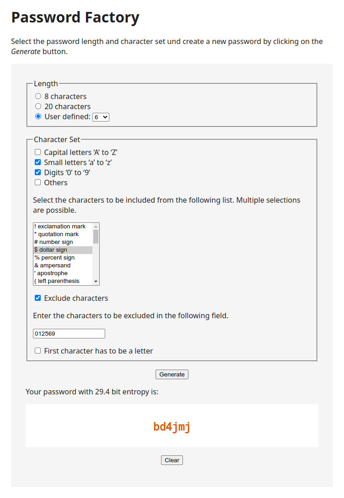

# Password Factory

A web service for generating random passwords.

The web service has a landing page so that the user can interact
with the service.  The contents and style of the landing page is
fully customizable through an external HTML template.

Here is a screen shot of the landing page:

## Program Invocation

You can run the application manually or automatically during system
startup.  The source code distribution contains a template for a
Systemd service.

	Usage: password-factory [OPTION...]
	
	The password factory application is a web service for generating random
	passwords.  After starting the program, open a web browser and visit
	‘http://127.0.0.1:5776’ or ‘https://127.0.0.1:5777’.  Sending the process
	a HUP signal restarts the web service; a INT, QUIT, or TERM signal stops
	the web service.
	
	Options:
	  --http-port=NUMBER
	                    Port number for the HTTP server.  A value of zero
	                    disables the HTTP server.  Default is 5776.
	  --https-port=NUMBER
	                    Port number for the HTTPS server.  A value of zero
	                    disables the HTTPS server.  Default is 5777.
	  --ssl-certificate-file=FILENAME
	                    SSL certificate file name for the HTTPS server.
	                    Default is ‘example.pem’ in the current working
	                    directory.
	  --ssl-private-key-file=FILENAME
	                    SSL private key file name for the HTTPS server.
	                    Default is ‘example.key’ in the current working
	                    directory.
	  --non-local-http, --local-http
	                    Whether or not to only listen on IP address 127.0.0.1
	                    for HTTP requests.  Enabled by default.
	  --redirect-http-to-https, --no-redirect-http-to-https
	                    Whether or not to redirect all HTTP requests to HTTPS.
	                    Disabled by default.  This option only has an effect
	                    if both protocols are enabled.
	  --document-root=DIRNAME
	                    Top-level directory for the web servers.  Default
	                    is the current working directory.
	  --template-directory=DIRNAME
	                    Top-level directory for HTML temmplate files.
	                    Default is the current working directory.
	  --version         Display version number information.
	  --help            Display this help text.
